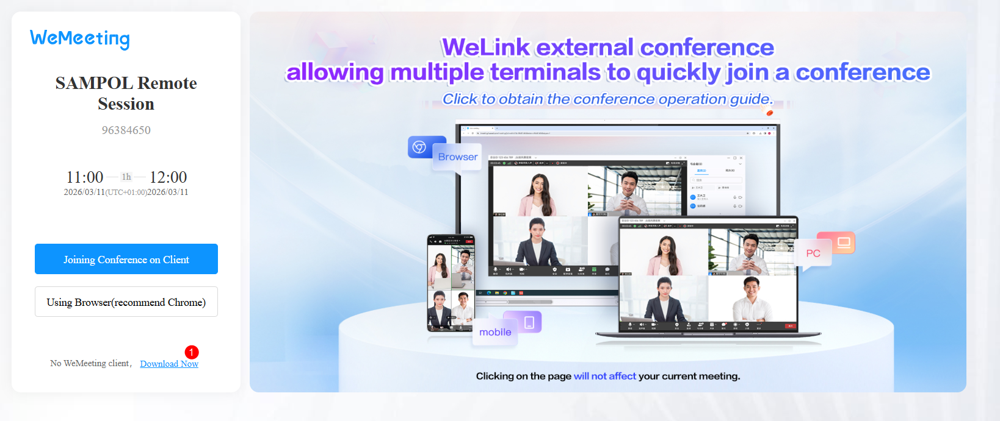
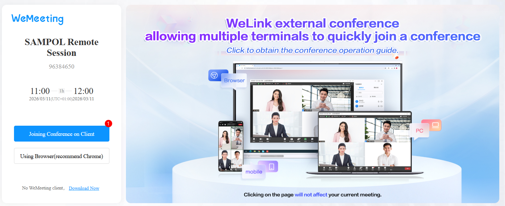

#Descargar el cliente de videoconferencia de Huawei

1- Click en el enlace de la reunión enviado.

2- En la pestaña abierta del navegador, hacer click en Download Now

3- Esperar que termine la descarga de a aplicación. 

4- Instalar la aplicación, dejando los valores predeterminados y aceptando los términos y condiciones. 

5- Una vez finalizada la instalación, refrescar la ventana del navegador y hacer click en JOINING CONFERENCE ON CLIENT. 
   
