### Configurar interconexión de AD con NCE Campus

## **CONTEXTO**

El sistema iMaster NCE-Campus puede conectarse e intercambiar información con servidores de Active Directory (AD), los cuales suelen utilizarse en empresas para gestionar usuarios y contraseñas de forma centralizada.

**REQUISITOS**

Dependiendo del modo de sincronización que elija, el sistema funcionará de la siguiente manera:

*   **Si selecciona Unsynchronized account/organization structure:** No hay límite en la cantidad de unidades organizativas (OU), grupos o usuarios que puede tener en su servidor AD.
*   **Si selecciona cualquier otro modo de sincronización (diferente al anterior):** Al importar (sincronizar) los datos desde su servidor AD al sistema iMaster NCE-Campus, se aplicarán los siguientes límites:
    *   Máximo 50,000 unidades organizativas (OU) o grupos por empresa (tenant).
    *   Cada OU o grupo puede tener hasta 20 niveles de subcarpetas (anidamiento).
    *   Cada OU o grupo puede contener hasta 1,000 sub-OU o subgrupos.


  **Grupo de Usuarios Creado:** Asegúrese de haber creado un grupo de usuarios. Si necesita ayuda, consulte la sección "Cómo configurar un grupo de usuarios".[Link] (https://support.huawei.com/hedex/hdx.do?docid=EDOC1100331202&id=EN-US_TOPIC_0000001829897477)
   

  **Datos del Servidor AD:** Tenga a mano los parámetros de configuración de su servidor AD (como dirección del servidor, nombre de dominio, credenciales, etc.), ya que los necesitará durante el proceso.
   

## **PROCEDIMIENTO** ##

### **Paso 1: Agregar el Controlador a un Dominio AD** ###

Nota importante: 

Solo necesitará configurar un dominio AD si su tenant tiene habilitada la autenticación MSCHAPv2. A continuación, le explicamos cómo activar MSCHAPv2 en el tenant


1.  Acceda al sistema: Inicie sesión en iMaster NCE-Campus como administrador (admin)

2.  Navegue a:  Admission Management > Admission Policy > Authentication and Authorization > Authentication Rule

3.  En la página Authentication Rule establezca el modo de autenticación: En la opción "Authentication mode", seleccione "User access authentication" 

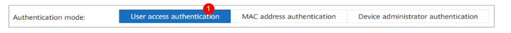

Seleccione el protocolo de autenticación EAP-PEAP-MSCHAPv2. Este protocolo funciona tanto para cuentas locales como para cuentas sincronizadas desde servidores AD y LDAP.

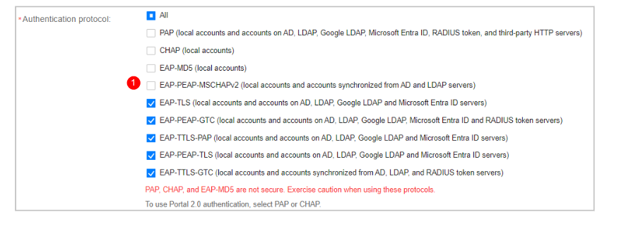


### **Paso 2: Configurar la resolución de nombres DNS en el servidor** ###

Este paso es necesario para que el sistema pueda encontrar y comunicarse con su servidor de Active Directory usando su nombre de dominio.


1.  **Acceda al servidor:**
    *   Conéctese SSH al servidor del iMaster NCE-Campus, en caso de ser un clúster, conectrase a todos los nodos, incluyendo DR.
    *   Inicie sesión con el usuario **`sopuser`**.
    *   Una vez dentro, cambie al usuario administrador **`root`** ( usando el comando `su - root`).

2.  **Edite el archivo de configuración DNS:**
    *   Abra el archivo de configuración de DNS con un editor de texto. Por ejemplo, puede usar el comando:
        
        ```bash
        vi /etc/resolv.conf
        ```
        

3.  **Agregue los servidores DNS:**
    *   Dentro del archivo, agregue una línea por cada servidor DNS que quiera configurar, usando el formato `nameserver [dirección_ip]`.
        
        **Ejemplo:** Si su servidor DNS tiene la dirección IP **10.10.10.10**, debe agregar la siguiente línea:
        
        ```
        nameserver 10.10.10.10
        ```
        
    *   **Importante:** Puede configurar hasta 3 servidores DNS. Si necesita más de uno, agregue una línea por cada uno.

4.  **Ajuste los tiempos de espera (si tiene múltiples DNS):**
    *   Si configuró más de un servidor DNS, es recomendable agregar parámetros de timeout para que el sistema no se quede esperando demasiado si un servidor no responde.
    *   Para ello, agregue la siguiente línea al archivo `/etc/resolv.conf`:
        
        ```
        options timeout:1 attempts:1 rotate
        ```
        
        *(Esto significa: espere 1 segundo por respuesta, haga 1 intento por servidor y alterne el orden de los servidores).*

5.  **Guarde y cierre:**
    *   Guarde los cambios realizados en el archivo y salga del editor.
    *   En el editor `vi`, esto suele hacerse presionando `Esc`, luego escribiendo `:wq` y presionando `Enter`.

**Resumen:**
Al finalizar, su archivo `/etc/resolv.conf` debería verse similar a esto si tiene dos servidores DNS:
```
nameserver IP1
nameserver IP2
options timeout:1 attempts:1 rotate
```

Después de configurar los servidores DNS, es fundamental verificar que todo esté funcionando bien. Siga estos pasos para asegurarse de que el sistema puede encontrar su controlador de dominio (DC) de Active Directory.


Ejecute el comando de verificación en cada uno de los servidores donde está instalado iMaster NCE-Campus:

nslookup -type=srv _ldap._tcp.dc._msdcs.[nombre_del_dominio_AD]

Ejemplo práctico:
Si su dominio de Active Directory se llama empresa.local, el comando sería:


nslookup -type=srv _ldap._tcp.dc._msdcs.empresa.local


Resultado correcto: El comando debe devolver una o más direcciones IP correspondientes a sus controladores de dominio. No se preocupe si aparecen controladores de dominio de otros sitios o ubicaciones; lo importante es que el servidor DNS esté respondiendo a la consulta.

Resultado incorrecto: Si el comando no devuelve ninguna IP o muestra un error, significa que la configuración DNS no es correcta o que el servidor DNS no tiene la información necesaria sobre su dominio AD.

### **Paso 3: Añadir el Active Directory (AD) en iMaster NCE-Campus** ###

Ahora procederemos a conectar formalmente su sistema iMaster NCE-Campus con su servidor de Active Directory. Siga estos pasos en orden:


**Acceder a la configuración de AD**

1.  Inicie sesión en iMaster NCE-Campus como administrador
   
2.  En el menú principal, navegue a:
    
    `System > System Management > Third-Party Service,`
    
3.  En el panel izquierdo, seleccione AD Domain Configuration


**Agregar el dominio AD**

1.  Haga clic en Add para crear un nuevo AD.
   
2.  Complete la siguiente información, según se muestra a modo de ejemplo en la imagen:
    *   **Nombre del dominio AD:** Escriba el nombre de su dominio (ej: `empresa.local`).
    *   **Usuario y contraseña:** Ingrese las credenciales de una cuenta con permisos para unir equipos al dominio.
    *   **Configuración avanzada:** Si es necesario, complete opciones adicionales como NetBIOS (obligatorio si el nombre NetBIOS es diferente al nombre del dominio).
  
  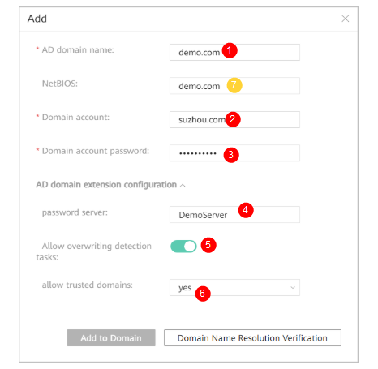

 Haga clic en **"Verificar Resolución de Nombres de Dominio"** para comprobar que el sistema puede encontrar su dominio AD.

 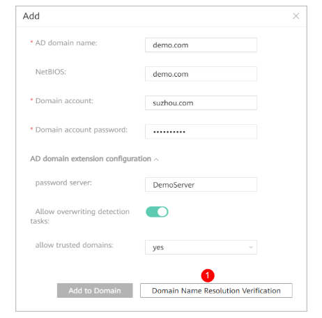

 Si la verificación es exitosa, haga clic en **"Agregar al Dominio"**.


 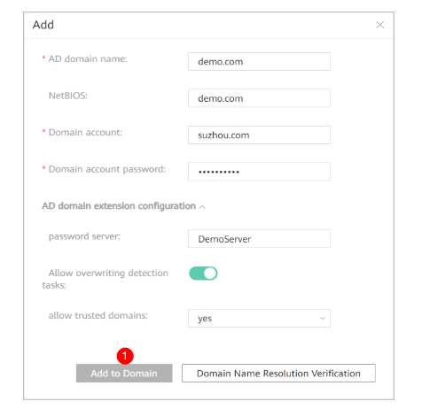


**Verificar el estado de cada servidor (nodo)**

Una vez agregado el dominio, puede verificar el estado de confianza con cada servidor:

 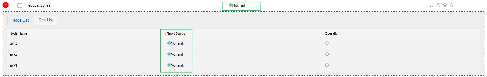

 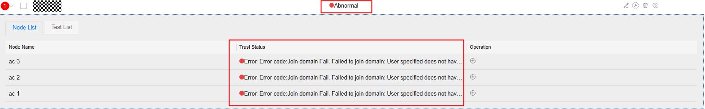

Haga clic en el icono **`>`** junto al nombre del dominio AD para ver la información de cada nodo.

**Indicadores de estado:**
  
  🟢 **Verde:** Normal (funciona correctamente)
   
  🟡 **Amarillo:** Advertencia (funciona con limitaciones)
  
  🔴 **Rojo:** Anormal (no funciona, requiere solución)
  
  ⚪ **Gris:** No ejecutado
   
  🔄 **Círculo giratorio:** En proceso
    

**Si algún nodo muestra estado rojo**, solucione el problema siguiendo las indicaciones que aparecen en pantalla. El caso más típico de fallo, se debe a que el NCE no está bien agregado dentro del servidor de AD. 

**Si el estado es amarillo** y el motivo es "cuenta de detección no configurada":

1.  Vaya a la pestaña **"Lista de Verificación"**.
2.  Haga clic en **"Configurar Cuenta de Detección"**.
3.  Ingrese una cuenta válida del dominio AD y haga clic en **"Aceptar"**.
   
   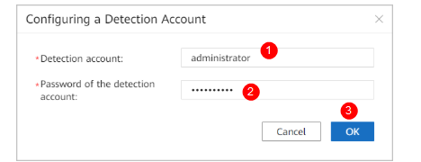

Vuelva a ejecutar la verificación, en Refresh.


### **Paso 4: Configurar la sincronización con Active Directory (AD) en iMaster NCE-Campus**

Ahora configuraremos la conexión para que los usuarios y grupos de su Active Directory se sincronicen automáticamente con iMaster NCE-Campus. Siga estos pasos en orden:

**Acceder a la configuración de sincronización**

1.  Ingrese al NCE Campus con el usuario de tenant. En el menú principal, navegue a:
    
    `Admission Management > Admission Resource > External Data Source > AD/LDAP Synchronization`
    


**Crear y configurar la conexión con el servidor AD**

1.  Haga clic en **"Crear"**.
2.  Complete los parámetros de conexión con su servidor AD. Necesitará tener a mano la dirección del servidor, puerto, etc. La siguiente figura se presenta a modo de ejemplo
   
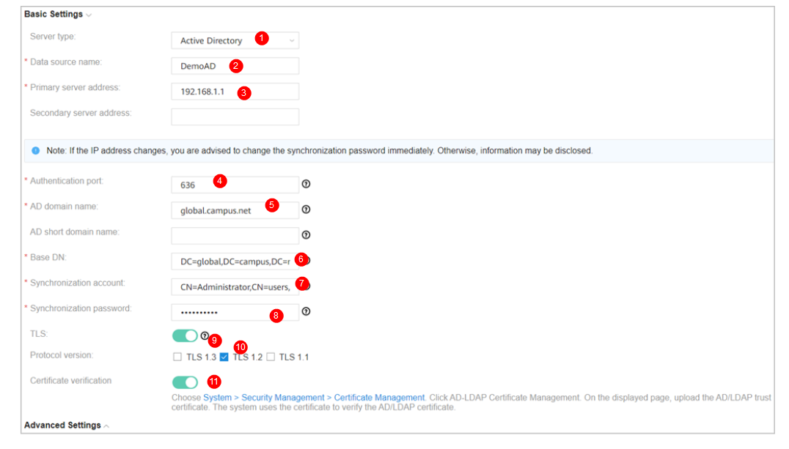

**Verifique la conexión:**
   Pruebe la conexión al AD mediante Test Connection

    *   Si aparece el icono **🟢** junto a la dirección del servidor, la conexión es exitosa.
    *   Si aparece el icono **🔴**, la conexión ha fallado. Revise los datos ingresados.

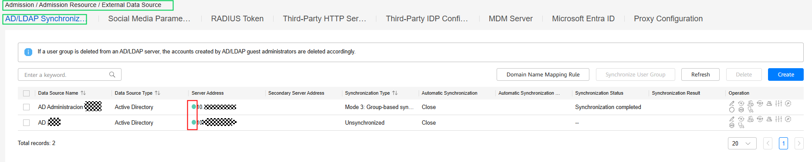
---

**Configuración**

En los siguientes pasos se deberá configurar los parámetros del AD: 

 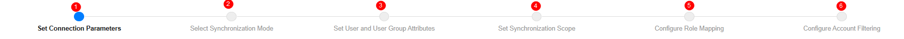

**Seleccionar el modo de sincronización**

Elija el modo que mejor se adapte a su organización:

| Modo | Descripción | Cuándo usarlo |
|------|-------------|---------------|
| **Modo 1 (Basado en OU)** | Sincroniza usuarios según las Unidades Organizativas (OU) de su AD. La estructura de carpetas de su AD se replica en iMaster NCE-Campus. | Cuando su AD está organizado por OU y quiere mantener esa misma estructura. |
| **Modo 2 (Basado en grupos - OU como estructura)** | Similar al modo 1, pero con enfoque en grupos. | Cuando su organización usa grupos dentro de OU. |
| **Modo 3 (Basado en grupos - grupos como estructura)** | Sincroniza basándose en grupos de seguridad de AD. | Cuando su AD está organizado principalmente por grupos. |
| **Modo 5 (Estructura plana o personalizada)** | Sincronización con estructura plana o con fórmulas personalizadas. | Para casos avanzados que requieren personalización. |
| **Por condiciones** | Sincroniza solo los usuarios que cumplen condiciones específicas. | Cuando necesita filtrar qué usuarios se sincronizan. |
| **Sin sincronización** | No sincroniza cuentas ni estructura organizativa. | Cuando solo usa autenticación en tiempo real sin almacenar usuarios. |

**Para los modos que usan fórmulas:**
El sistema usa fórmulas como `SUBSTRING("dn",",", 1, "START")` para determinar a qué grupo pertenece un usuario. No se preocupe, los valores por defecto suelen funcionar correctamente.

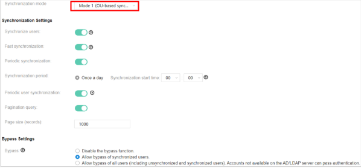
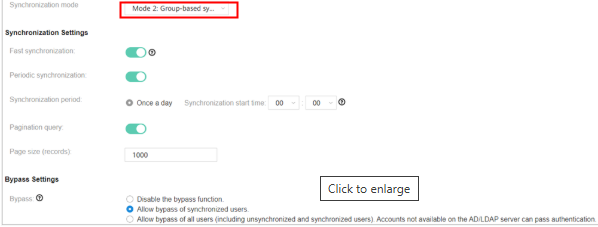
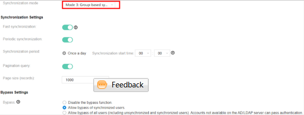
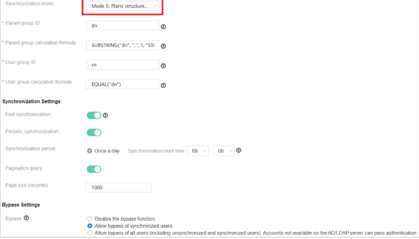
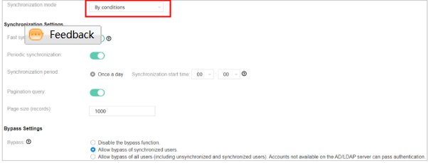
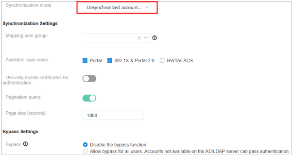
---

**Configurar opciones adicionales**

*   **Grupo de usuarios destino:** Seleccione el grupo donde se ubicarán los usuarios sincronizados.
*   **Modo de inicio de sesión disponible:** Elija qué tipo de autenticación podrán usar estos usuarios:
    *   Para autenticación por portal web: seleccione **Portal** o **802.1X & Portal 2.0**
    *   Para autenticación 802.1X: seleccione **802.1X & Portal 2.0**
    *   Para autenticación HWTACACS: seleccione **HWTACACS**
*   **Usar solo certificados móviles:** Active solo si usa autenticación por certificados 802.1X.
*   **Bypass (modo de contingencia):** Se recomienda activarlo. Permite que los usuarios accedan incluso si el servidor AD falla (solo en ciertos modos de autenticación).


**Configurar atributos de usuarios y grupos**

En la página **"Configurar Atributos de Usuario y Grupo de Usuarios"**:

1.  **Mantenga los valores por defecto** en la mayoría de los casos. El sistema ya viene preconfigurado con los atributos estándar de Active Directory.
2.  Estos atributos definen cómo se mapea la información del AD (nombre, cuenta, email, teléfono, etc.) a los campos en iMaster NCE-Campus.


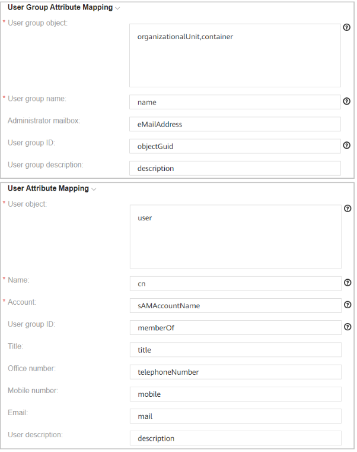

**Consideraciones importantes:**
*   Si elimina la configuración del servidor, **todos los usuarios y grupos sincronizados se eliminarán** del sistema. No cree usuarios manualmente dentro de grupos sincronizados para evitar borrados accidentales.
*   Para autenticación, puede usar `sAMAccountName` o `userPrincipalName`. Tenga en cuenta que `sAMAccountName` solo muestra los primeros 20 caracteres en los registros.

**Configuración de fecha de expiración:**
Si su AD tiene un campo personalizado para fecha de expiración de usuarios, puede configurarlo aquí. El sistema verificará esta fecha durante la autenticación.

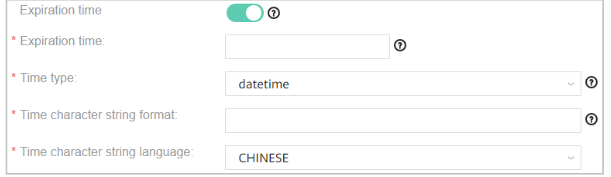


**Configurar el alcance de la sincronización**

Ahora definirá **qué** se sincroniza exactamente desde su AD:

1.  **Configure el alcance para cuentas a sincronizar:**
    *   **Grupo de usuarios destino:** Seleccione dónde se almacenarán los usuarios en iMaster NCE-Campus.
    *   **Directorio de OU/grupo origen:** Seleccione las OU o grupos específicos de su AD que desea sincronizar.
    
    *Si no encuentra OU o grupos, revise que el atributo "Nombre de grupo de usuarios" configurado en el paso 4.6 coincida con el de su servidor AD.*

2.  **Si NO sincroniza cuentas** (solo autenticación en tiempo real), configure los grupos externos que se usarán para la autenticación.


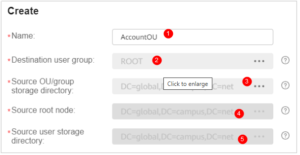
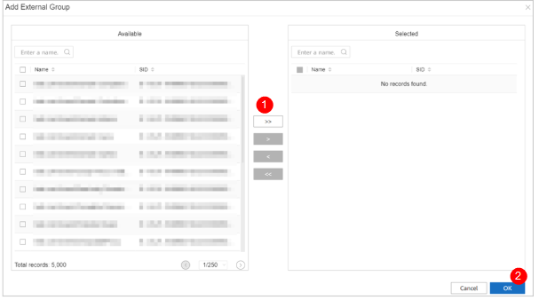
-
**(Opcional) Configurar reglas de asignación de roles**

Puede asignar automáticamente roles específicos a usuarios según sus atributos en AD:

*   **Regla de coincidencia:** Elija si el usuario debe cumplir UNA condición (OR) o TODAS (AND).
*   **Filtros:** Defina condiciones como "si el usuario pertenece al grupo X, asígnale el rol Y".
*   **Delimitador:** Si un usuario pertenece a múltiples grupos, puede asignarle múltiples roles.

**Nota:** Si los usuarios se sincronizan, los roles se asignan durante la sincronización. Si no se sincronizan, se asignan durante la autenticación. Los roles asignados manualmente tienen prioridad sobre los automáticos.


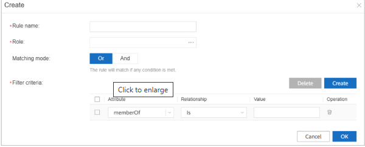
---

**(Opcional) Configurar filtros de cuentas**

Puede excluir o incluir OU específicas en la sincronización:
*   **Excluir OU específicas:** No sincronizará usuarios de esas OU.
*   **Incluir solo OU específicas:** Sincronizará ÚNICAMENTE usuarios de esas OU.


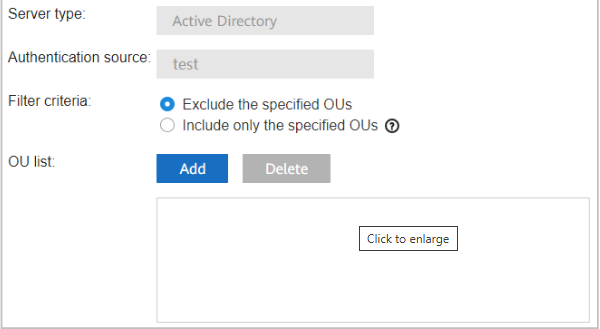
---

**Sincronizar cuentas AD/LDAP**

Una vez configurado todo:

*   **Para sincronizar SOLO grupos:** Seleccione la fuente de datos AD y haga clic en **"Sincronizar Grupo de Usuarios"**.
  
  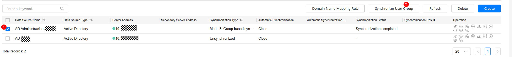

*   **Para sincronizar grupos y usuarios inmediatamente:** Haga clic en el icono (ejecutar sincronización).
*   
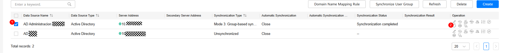
---

**Configurar reglas de autenticación para usar el AD**

Para que los usuarios puedan autenticarse contra su AD:

1.  Vaya a `Admission Management > Admission Policy > Authentication and Authorization > Authentication Rule`
   
2.  Cree o modifique una regla seleccionando:
    *   **Fuente de datos de autenticación:** El servidor AD que acaba de configurar
    *   **Coincidir grupos de usuarios:** Active y seleccione los grupos que tendrán acceso

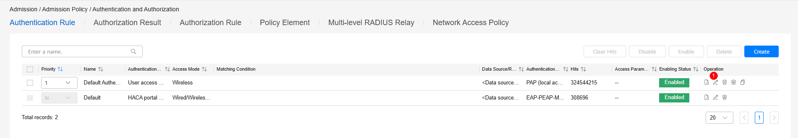
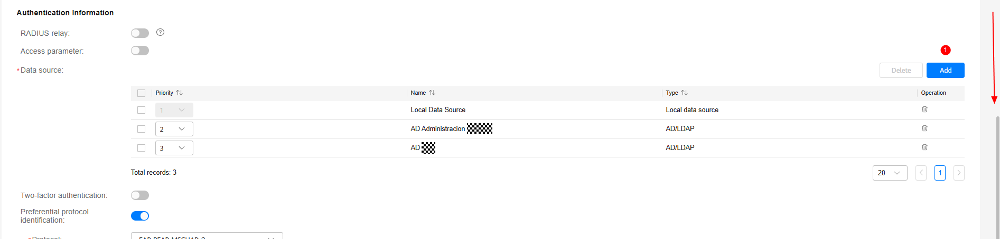

---


## FUENTES DE CONSULTA
https://support.huawei.com/
