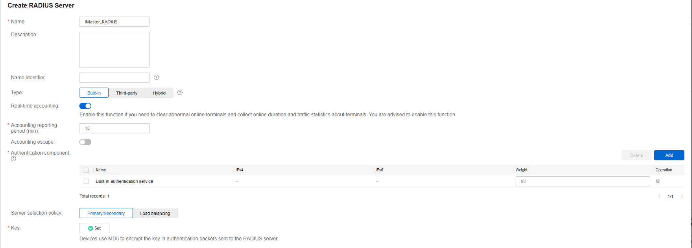
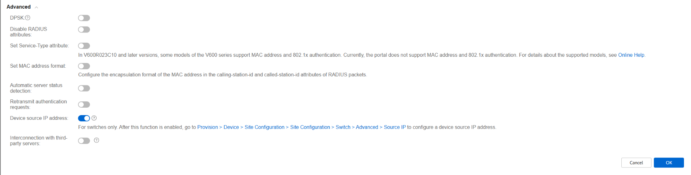

## Configuración de Servidor RADIUS Integrado en iMaster NCE-Campus

Esta guía le mostrará cómo crear y configurar un servidor RADIUS integrado (Built-in) para que los dispositivos de red (como switches y puntos de acceso) puedan enviar la información de autenticación y contabilidad (accounting) al sistema.

### **Paso a paso**

1.  **Acceda a la configuración de plantillas:**
    *   En el menú principal, navegue a:
        
        `Design > Network Design > Template Management`
        
    *   Asegúrese de estar en la pestaña Policy Template.

2.  **Localice la sección de Servidores RADIUS:**
    *   En el panel de navegación izquierdo, busque y seleccione **"RADIUS Server"**.

3.  **Cree un nuevo servidor RADIUS:**
    *   Haga clic en el botón **"Crear"**.

4.  **Configure los parámetros básicos:**
    *   **Tipo:** Seleccione **"Integrado"** (Built-in). Esto indica que usará el servidor RADIUS que viene dentro de iMaster NCE-Campus, no uno externo.
    *   **Período de reporte de contabilidad (Accounting reporting period):** Defina cada cuánto tiempo (en minutos) los dispositivos de red enviarán la información de contabilidad (estadísticas de sesión, tráfico usado, etc.). El valor recomendado suele ser **15 minutos**, aunque puede ajustarlo según sus necesidades.
    *   **Componente de autenticación:** Seleccione **"Servicio de autenticación integrado"** (Built-in authentication service). Esto vincula el servidor RADIUS con la base de usuarios local del sistema.
    *   **Clave (Key):** Establezca una clave secreta compartida. Esta misma clave deberá configurarla después en cada dispositivo de red (switch, AP) para que puedan comunicarse de forma segura con el servidor RADIUS.

 

**Configuración avanzada (recomendado):**

  1. Despliegue la sección **"Avanzado"**.
    
  2. Active la opción **"Dirección IP de origen del dispositivo"** (Device source IP address).
   
   **¿Para qué sirve?** Al activar esta opción, el servidor RADIUS utilizará la dirección IP del dispositivo de red (la IP desde la que llega la solicitud) como identificador, en lugar de depender de la dirección IP del cliente final. Esto es útil en entornos con NAT o cuando varios dispositivos comparten la misma IP de salida.
 
  

1.  **Finalice la creación:**
    *   Revise que todos los datos sean correctos.
    *   Haga clic en **"Aceptar"** o **"Guardar"** para crear el servidor RADIUS.

---

### **Resumen de parámetros configurados**

| Parámetro | Valor seleccionado | Descripción |
|-----------|-------------------|-------------|
| **Tipo** | Integrado (Built-in) | Usa el servidor RADIUS interno del sistema |
| **Período de contabilidad** | (según necesidad, ej: 15 min) | Frecuencia con la que los dispositivos envían estadísticas |
| **Componente de autenticación** | Servicio de autenticación integrado | Valida usuarios contra la base de datos local |
| **Clave (Key)** | (valor secreto) | Contraseña compartida con los dispositivos de red |
| **IP de origen del dispositivo** | Activado | Usa la IP del dispositivo como identificador |

---

### **Próximos pasos**

Una vez creado el servidor RADIUS integrado, deberá:

1.  **Aplicarlo en perfiles de autenticación:** Asociar este servidor RADIUS a los perfiles SSID (Wi-Fi) o a las políticas de autenticación por puerto (802.1X).
2.  **Configurar los dispositivos de red:** En cada switch o punto de acceso, deberá indicar que la autenticación RADIUS se realiza contra la IP de iMaster NCE-Campus, usando la misma **clave (Key)** que configuró en este paso.
3.  **Crear usuarios locales (si no usa AD):** Si no sincroniza con Active Directory, deberá crear los usuarios en `Gestión de Admisiones > Gestión de Usuarios`.

## FUENTES DE CONSULTA
https://support.huawei.com/
