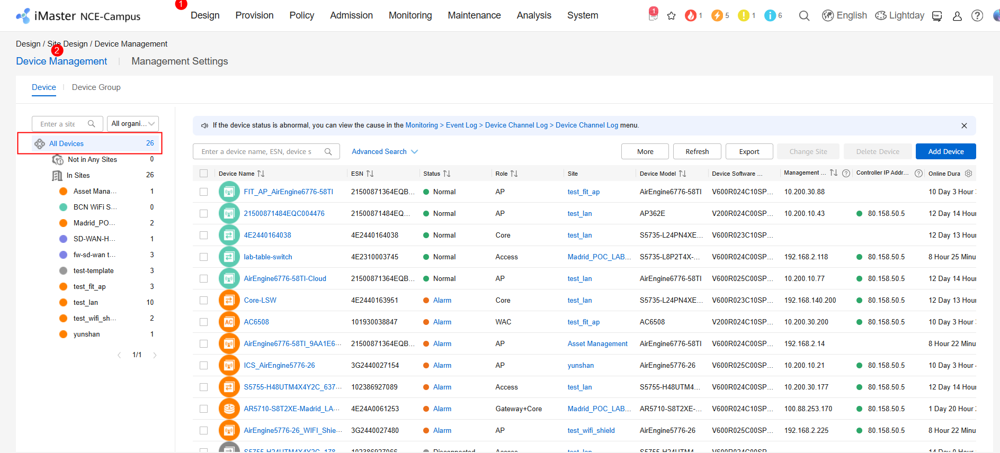
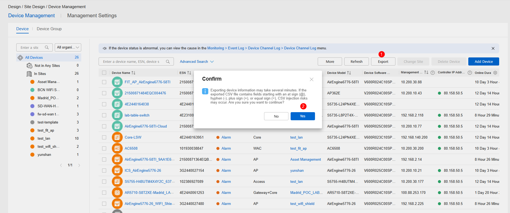
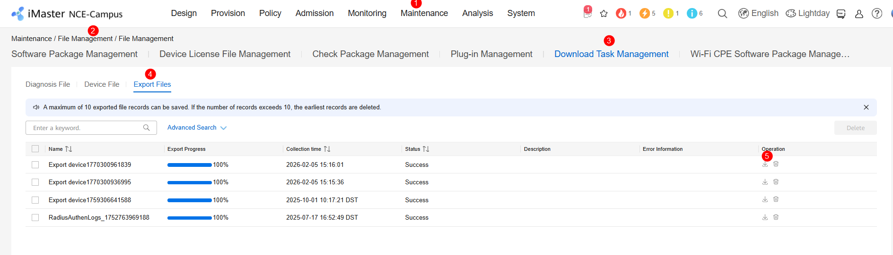
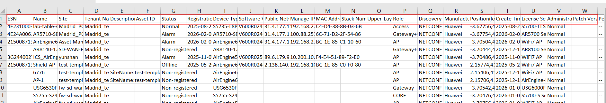

### Export Device List

Getting a list of devices registered in the NCE Campus. 

## Steps

1- Log in service plane NCE Campus

2- Access to Design / Site Design / Device Management

3- Choose the devices from which you want to export data. It could be a device, a site, or all devices.

In this case, all devices are choosing

4- Export the information

5- View the task on the Maintenance > File Management > File Management > Download Task Management Export Files page and download it.

6- Open the Excel exported. Here, you can find all information associated to devices.

