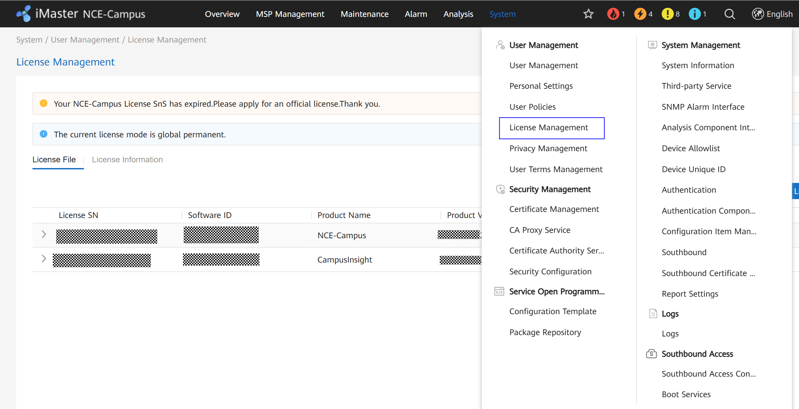
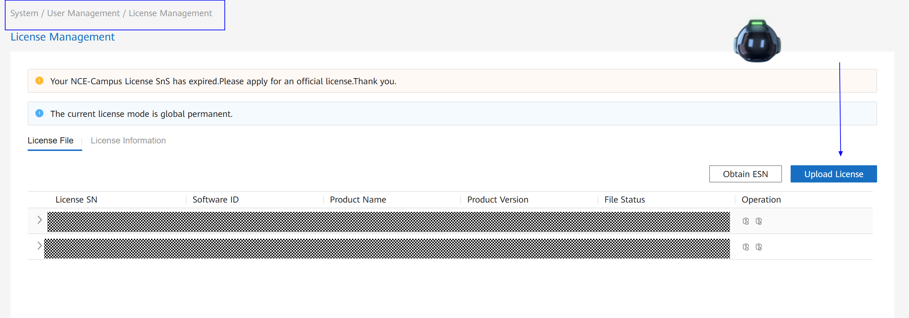

### Importar archivos de licencias en el NCE Campus

# **CONTEXTO**

El sistema iMaster NCE-Campus tiene varios tipos de licencias según las funcionalidades que el cliente quiera implementar. Los archivos de licencia estarán siempre en formato HTML. El cliente deberá importar este archivo en la plataforma. 

**Pasos**

1. Acceder al plano de servicio del NCE Campus con el usuario admin y la contraseña predefinida. 
2. Navegar hacia System>User Management>License Management

3. Cargar el archivo de licencia
